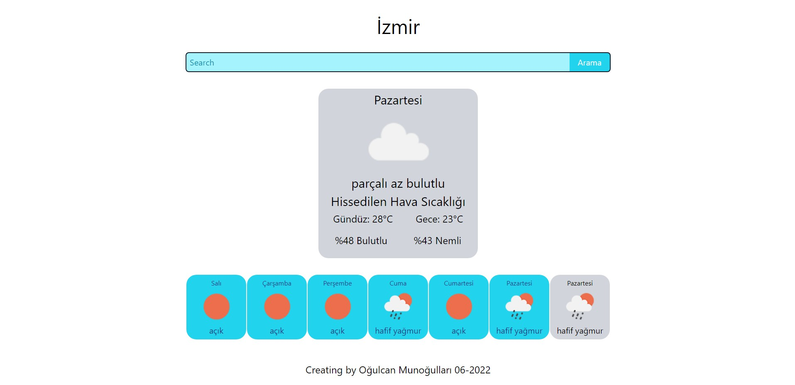

<h1> Weather App </h1>
<i> Live on <a href="https://ogulcan-weather.netlify.app/"> ogulcan-weather.netlify.app/ </a> <i>

   This app using your location to for results, but if you dont want to use locationdata you can control manually.  

   You can also search for any city you want. 

<h2> How to use: </h2>

   1. Use search input to what you want city to see 

   2. Click on the button to get weather data. 

   3. You can see the weather data. 

   4. You can also see details if you click weekly data. 

<h2> Tools, API's and langs what i use </h2
  

   1. React 

   2. Tailwind 

   3. Open Weather API 

   4. Geolocation API 

   5. Axios 

